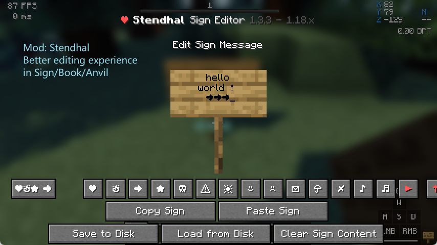
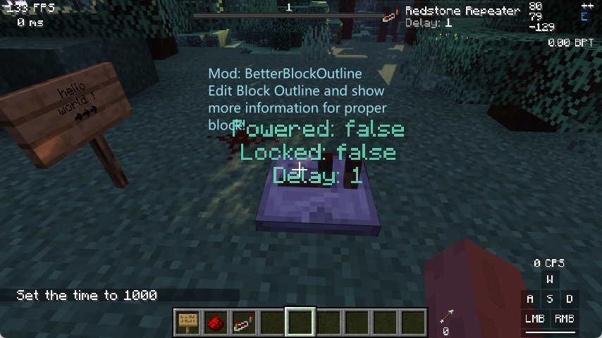

# Poko

<h6 align="center">1.16.5(Soon) | 🔼1.18.2(Quilt) | 1.19.1(Soon) </h6>
Poko is an ModPack dedicated to compatibility with the vanilla server, committed to introducing elegant tools and maintaining high performance, providing you with a highly customized gaming experience.

**Examples speak louder than words, Lead me to [ShowCases](#showcases)**

**Attention:** Some mods may be marked by anti-cheat on some servers. Please read [this page](./multi-play) before using!

## Feature

- **It's fast.** --- Even there are lots of mods in this modpack, it still can load very fast.
- **Reserve modifications space and practical priority** --- We added many useful tweaks that you wouldn't notice, and we did **Not** add mods like `Map/Litematica/IBE Editor...`, because we want to let it be your choice.
* **Alomost full OptifiFine Support** --- Thanks to awesome mod creators, Now you can enjoy `Shaders, ResoucePack, Connected textures, PBR, Custom Model...` on Fabric/Quilt Loaders!
- **The pursuit of experience, but abide by the principles** --- We avoid adding other visual effects to f**k your FPS, but we still recommend [those mods](./recommend) for you!(But you need a GOOD PC)
- **Highly pre-configuraed** ---All we want for you, is you can configure everything you see in the game, even disable it or make it personalise.
- **We know your pain** --- We don't do the whole fancy, You can modify anything comfortably. Thanks to awesome mod creators, you can `type command in portals`, `switch languages in 1s`,  `resize scoreboard/bossbar/actionbar` and do more things with these comfortable modification!
- **~~Fully Documented~~** --- **Not Yet**, We want to tell how to configure everything as you want, but it's a big work, so **coming soon**!

## ShowCases

and more things are waiting for you to discover!
