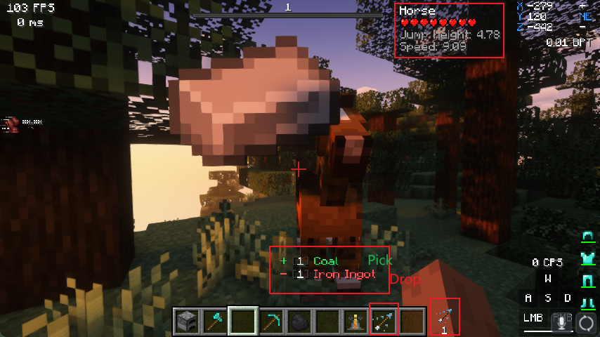
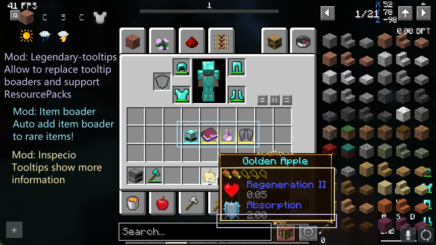
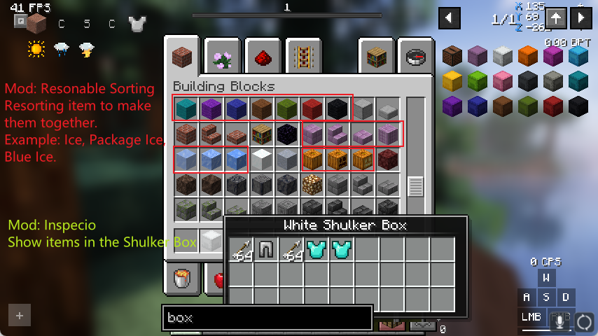
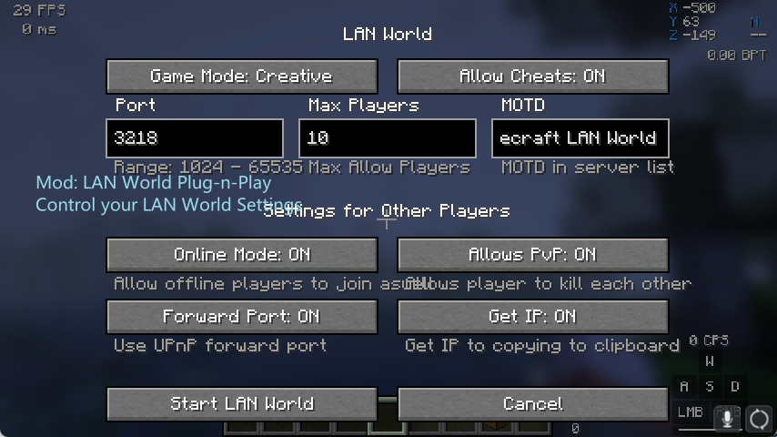

[Modrinth]:https://img.shields.io/badge/dynamic/json?color=5da545&label=modrinth&prefix=downloads%20&query=downloads&url=https://api.modrinth.com/v2/project/MeBY1jLx&style=for-the-badge&logo=data:image/svg+xml;base64,PHN2ZyB4bWxucz0iaHR0cDovL3d3dy53My5vcmcvMjAwMC9zdmciIHZpZXdCb3g9IjAgMCAxMSAxMSIgd2lkdGg9IjE0LjY2NyIgaGVpZ2h0PSIxNC42NjciICB4bWxuczp2PSJodHRwczovL3ZlY3RhLmlvL25hbm8iPjxkZWZzPjxjbGlwUGF0aCBpZD0iQSI+PHBhdGggZD0iTTAgMGgxMXYxMUgweiIvPjwvY2xpcFBhdGg+PC9kZWZzPjxnIGNsaXAtcGF0aD0idXJsKCNBKSI+PHBhdGggZD0iTTEuMzA5IDcuODU3YTQuNjQgNC42NCAwIDAgMS0uNDYxLTEuMDYzSDBDLjU5MSA5LjIwNiAyLjc5NiAxMSA1LjQyMiAxMWMxLjk4MSAwIDMuNzIyLTEuMDIgNC43MTEtMi41NTZoMGwtLjc1LS4zNDVjLS44NTQgMS4yNjEtMi4zMSAyLjA5Mi0zLjk2MSAyLjA5MmE0Ljc4IDQuNzggMCAwIDEtMy4wMDUtMS4wNTVsMS44MDktMS40NzQuOTg0Ljg0NyAxLjkwNS0xLjAwM0w4LjE3NCA1LjgybC0uMzg0LS43ODYtMS4xMTYuNjM1LS41MTYuNjk0LS42MjYuMjM2LS44NzMtLjM4N2gwbC0uMjEzLS45MS4zNTUtLjU2Ljc4Ny0uMzcuODQ1LS45NTktLjcwMi0uNTEtMS44NzQuNzEzLTEuMzYyIDEuNjUxLjY0NSAxLjA5OC0xLjgzMSAxLjQ5MnptOS42MTQtMS40NEE1LjQ0IDUuNDQgMCAwIDAgMTEgNS41QzExIDIuNDY0IDguNTAxIDAgNS40MjIgMCAyLjc5NiAwIC41OTEgMS43OTQgMCA0LjIwNmguODQ4QzEuNDE5IDIuMjQ1IDMuMjUyLjgwOSA1LjQyMi44MDljMi42MjYgMCA0Ljc1OCAyLjEwMiA0Ljc1OCA0LjY5MSAwIC4xOS0uMDEyLjM3Ni0uMDM0LjU2bC43NzcuMzU3aDB6IiBmaWxsLXJ1bGU9ImV2ZW5vZGQiIGZpbGw9IiM1ZGE0MjYiLz48L2c+PC9zdmc+
[Documentation]:https://img.shields.io/badge/-Documentation-blue.svg?logo=Wikipedia&style=for-the-badge&logoColor=black
[Discord]:https://img.shields.io/badge/-Discord-5865F2.svg?logo=discord&style=for-the-badge&logoColor=white
# Poko

<h6 align="center">1.16.5(Soon) | 🔼1.18.2(Quilt) | 1.19.1(Soon) </h6>
Poko is an ModPack dedicated to compatibility with the vanilla server, committed to introducing elegant tools and maintaining high performance, providing you with a highly customized gaming experience.
 [![Modrinth]](https://rewrite.modrinth.com/modpacks/poko)
[![Discord]](https://discord.gg/dCVkjehCFS)
 **Examples speak louder than words, Lead me to [ShowCases](#showcases)**
 **Attention:** Some mods may be marked by anti-cheat on some servers. Please read [this page](./multi-play) before using!

## Feature

- **It's fast.** --- Even there are lots of mods in this modpack, it still can load very fast.
- **Reserve modifications space and practical priority** --- We added many useful tweaks that you wouldn't notice, and we did **Not** add mods like `Map/Litematica/IBE Editor...`, because we want to let it be your choice.
- **Alomost full OptifiFine Support** --- Thanks to awesome mod creators, Now you can enjoy `Shaders, ResoucePack, Connected textures, PBR, Custom Model...` on Fabric/Quilt Loaders!
- **The pursuit of experience, but abide by the principles** --- We avoid adding other visual effects to f**k your FPS, but we still recommend [those mods](./recommend) for you!(But you need a GOOD PC)
- **Highly pre-configuraed** ---All we want for you, is you can configure everything you see in the game, even disable it or make it personalise.
- **We know your pain** --- We don't do the whole fancy, You can modify anything comfortably. Thanks to awesome mod creators, you can `type command in portals`, `switch languages in 1s`,  `resize scoreboard/bossbar/actionbar` and do more things with these comfortable modification!
- **~~Fully Documented~~** --- **Not Yet**, We want to tell how to configure everything as you want, but it's a big work, so **coming soon**!

## ShowCases

{ loading=lazy }

{ loading=lazy }

{ loading=lazy }

{ loading=lazy }

{ loading=lazy }

{ loading=lazy }

{ loading=lazy }

{ loading=lazy }

{ loading=lazy }

and more things are waiting for you to discover!
