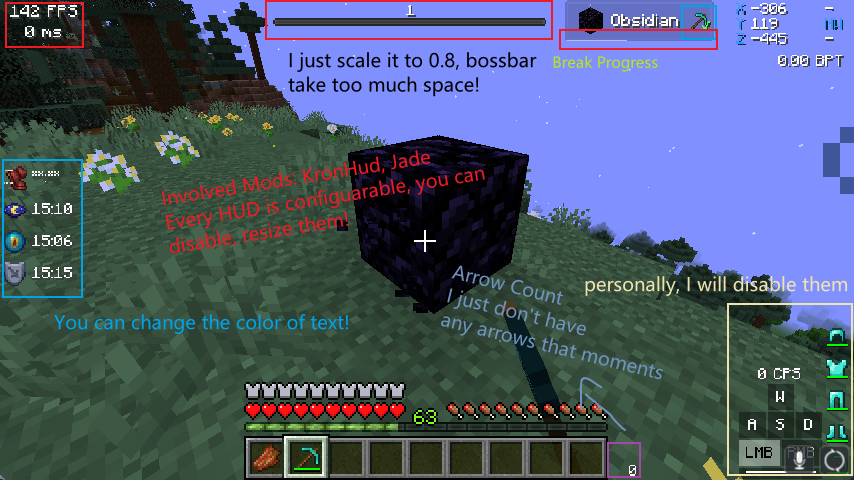
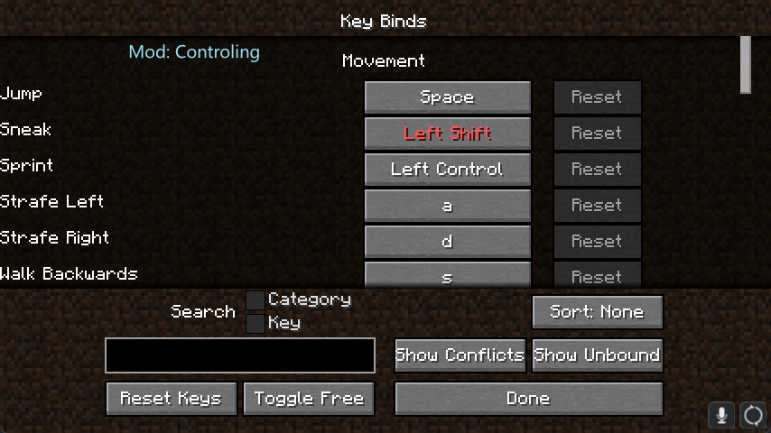

# Poko
[Modrint]:https://img.shields.io/badge/dynamic/json?color=5da545&label=modrinth&prefix=downloads%20&query=downloads&url=https://api.modrinth.com/api/v1/mod/AANobbMI&style=flat-square&logo=data:image/svg+xml;base64,PHN2ZyB4bWxucz0iaHR0cDovL3d3dy53My5vcmcvMjAwMC9zdmciIHZpZXdCb3g9IjAgMCAxMSAxMSIgd2lkdGg9IjE0LjY2NyIgaGVpZ2h0PSIxNC42NjciICB4bWxuczp2PSJodHRwczovL3ZlY3RhLmlvL25hbm8iPjxkZWZzPjxjbGlwUGF0aCBpZD0iQSI+PHBhdGggZD0iTTAgMGgxMXYxMUgweiIvPjwvY2xpcFBhdGg+PC9kZWZzPjxnIGNsaXAtcGF0aD0idXJsKCNBKSI+PHBhdGggZD0iTTEuMzA5IDcuODU3YTQuNjQgNC42NCAwIDAgMS0uNDYxLTEuMDYzSDBDLjU5MSA5LjIwNiAyLjc5NiAxMSA1LjQyMiAxMWMxLjk4MSAwIDMuNzIyLTEuMDIgNC43MTEtMi41NTZoMGwtLjc1LS4zNDVjLS44NTQgMS4yNjEtMi4zMSAyLjA5Mi0zLjk2MSAyLjA5MmE0Ljc4IDQuNzggMCAwIDEtMy4wMDUtMS4wNTVsMS44MDktMS40NzQuOTg0Ljg0NyAxLjkwNS0xLjAwM0w4LjE3NCA1LjgybC0uMzg0LS43ODYtMS4xMTYuNjM1LS41MTYuNjk0LS42MjYuMjM2LS44NzMtLjM4N2gwbC0uMjEzLS45MS4zNTUtLjU2Ljc4Ny0uMzcuODQ1LS45NTktLjcwMi0uNTEtMS44NzQuNzEzLTEuMzYyIDEuNjUxLjY0NSAxLjA5OC0xLjgzMSAxLjQ5MnptOS42MTQtMS40NEE1LjQ0IDUuNDQgMCAwIDAgMTEgNS41QzExIDIuNDY0IDguNTAxIDAgNS40MjIgMCAyLjc5NiAwIC41OTEgMS43OTQgMCA0LjIwNmguODQ4QzEuNDE5IDIuMjQ1IDMuMjUyLjgwOSA1LjQyMi44MDljMi42MjYgMCA0Ljc1OCAyLjEwMiA0Ljc1OCA0LjY5MSAwIC4xOS0uMDEyLjM3Ni0uMDM0LjU2bC43NzcuMzU3aDB6IiBmaWxsLXJ1bGU9ImV2ZW5vZGQiIGZpbGw9IiM1ZGE0MjYiLz48L2c+PC9zdmc+
[Documentation]:https://img.shields.io/badge/-Documentation-blue.svg?logo=Wikipedia&style=for-the-badge&logoColor=black
[Discord]:https://img.shields.io/badge/-Discord-5865F2.svg?logo=discord&style=for-the-badge&logoColor=white

<h6 align="center">1.16.5(Soon) | 🔼1.18.2(Quilt) | 1.19.1(Soon) </h6>
Poko是一个兼容原版且在提供大量工具的同时维持高性能表现的生存向整合包，在这里您可以追求高客制化的游戏体验！

**事实胜于雄辩, 让我们看看[游戏截图](#游戏演示)**

**注意:** 一些模组在某些服务器可能无法正常工作，请参阅[此页面](./multi-play)获取更多信息!

## 优点一览

- **简约高效** --- 尽管本整合包引入了大量的实用工具，但仍然能为您提供流畅的游戏体验。
- **实用优先，对二次修改友善** --- 我们添加了大量您很难注意到的内容，且我们**不会**添加诸如 `地图/投影/背包编辑器` 等额外的功能模组，选择权永远在您的手上！
- **近乎完全的 Optifine 支持** --- 得益于社区的强大，您现在可以在 Fabric/Quilt 上享受由光影，自定义材质，无缝链接，动态光源等功能所带来的便利!
- **尊重体验但恪守原则** --- 我们极力避免在该整合包添加纯视效模组, 但如果您有一台高性能电脑，我们仍然向您推荐那些提升游戏体验的[优质模组](./recommend)。
- **高度预配置** --- 不用再花心思去专研模组配置，我们预制了适合大部分游戏情境的设置，而且这些设置您完全可以再次进行个性化地更改。
- **深知痛处，方得人心** --- 我们不整花里胡哨，您可以舒适地更改一切内容。多亏了强大的模组制作者，您现在无需再为服务器地狱门卡屏，语言切换耗时，计分板/Boss血条/Actionbar 占用空间所困扰，您可以自由的配置他们，甚至是通过合理配置解决更多问题。
- ~~文档齐备~~ --- 还没写, 我们的预期是教您如果客制化您的游戏，但这是一项工作量极大的工程，所以**敬请期待吧**!

## 游戏演示

{ loading=lazy }

{ loading=lazy }

{ loading=lazy }

{ loading=lazy }

{ loading=lazy }

{ loading=lazy }

{ loading=lazy }

{ loading=lazy }

{ loading=lazy }

and more things are waiting for you to discover!
